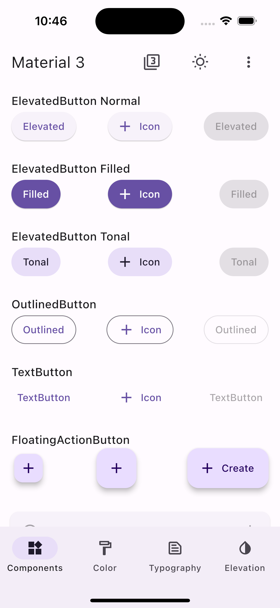
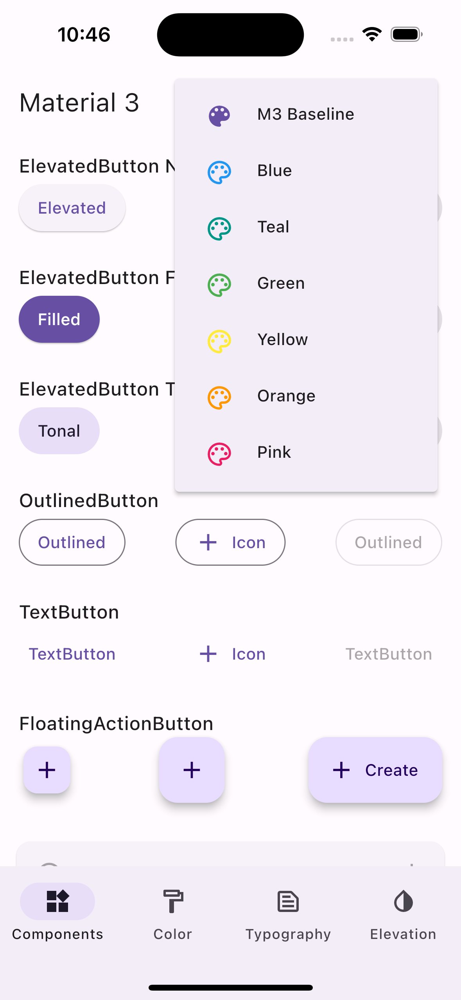
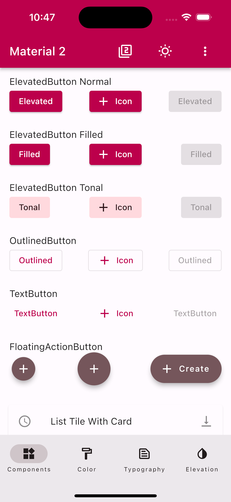
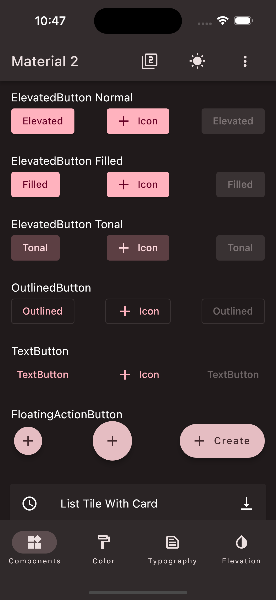
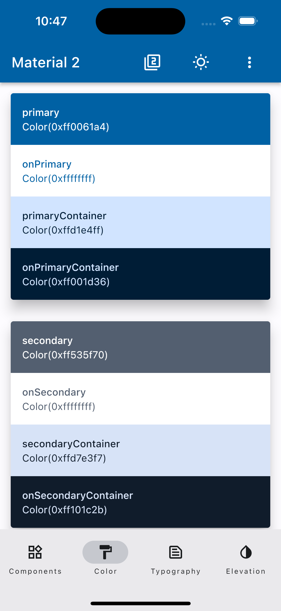

# Diplom_work

A new Flutter project.

## Getting Started

My `diplom_work` Aplication.

  
  
  

  
  
  

### Getting Started

## Requirements
- Dart sdk: ">=2.19.0 <4.0.0"
- Flutter: "3.7.7"
- Android: minSdkVersion 17
- iOS: --ios-language swift, Xcode version >= 14.0.0